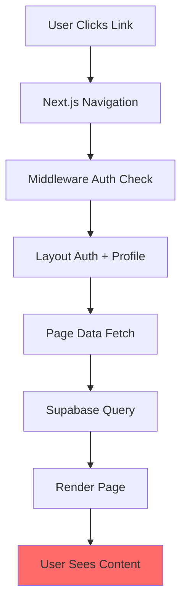
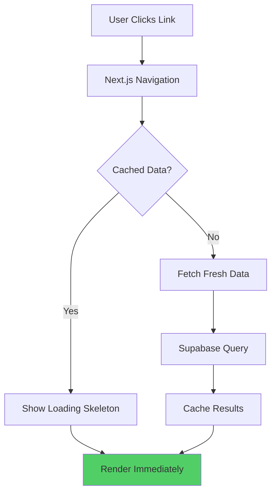

# Performance Optimization Plan for RecklessBear Admin

## Problem Statement
The app loads slowly (~5 seconds) when switching between pages. This is caused by multiple performance bottlenecks identified during code analysis.

## Root Causes Identified

### 1. Missing Loading States (No Suspense Boundaries)
- No `loading.tsx` files in any route directory
- Users see blank pages or a long "Loading..." indicator
- React Suspense boundaries are not utilized

### 2. No Data Caching
- Each page load fetches ALL data fresh from Supabase
- `force-dynamic` is set on all pages, disabling any default Next.js caching
- No stale-while-revalidate strategy implemented
- Leads, Stock, and Jobs pages make large queries on every navigation

### 3. Redundant Authentication Checks
- The app layout (`app/(app)/layout.tsx`) performs auth + profile lookup on EVERY page request
- Middleware validates session but layout still re-validates
- Multiple `createClient()` calls per page (one in layout, one in page component)

### 4. Sequential Database Queries
- Dashboard queries run many sequential `Promise.all` groups but with individual queries per item
- Stock page loads materials, transactions, consumption, adjustments sequentially
- Jobs page loads 2000 leads with full data

### 5. No Image Optimization Priority
- Cloudinary images lack explicit priority on first page load
- The logos could block rendering

## Proposed Solution

### Phase 1: Add Loading UI (Immediate Visual Improvement)
Add `loading.tsx` files for all routes with skeleton loaders:

```
app/(app)/dashboard/loading.tsx
app/(app)/leads/loading.tsx
app/(app)/stock/loading.tsx
app/(app)/jobs/loading.tsx
app/(app)/inbox/loading.tsx
app/(app)/analytics/loading.tsx
app/(app)/users/loading.tsx
```

Each loading file will show skeleton cards matching the page layout - this gives instant feedback while data loads.

### Phase 2: Optimize Authentication Flow
1. Cache the user session in a React context or use Next.js experimental cache
2. Modify `app/(app)/layout.tsx` to use cached user data
3. Consider using `unstable_cache` for profile lookups

### Phase 3: Add Data Caching Strategy
1. Remove unnecessary `force-dynamic` where appropriate
2. Add explicit caching with `revalidate` values (e.g., 30 seconds for dashboard stats)
3. Implement stale-while-revalidate for less critical data
4. Add database indexes if missing (check schema)

### Phase 4: Query Optimization
1. Review and optimize large queries (e.g., Jobs 2000 limit)
2. Add proper pagination where not present
3. Consider using RPC for complex aggregations

## Mermaid Diagram - Current vs Optimized Flow



After optimization:



## Implementation Priority

| Priority | Item | Impact | Effort |
|----------|------|--------|--------|
| P0 | Add loading.tsx files | High | Low |
| P1 | Cache auth in layout | Medium | Medium |
| P1 | Add revalidate caching | High | Medium |
| P2 | Optimize queries | Medium | Medium |
| P2 | Image priority | Low | Low |

## Expected Results

- Initial load: 5s → ~1-2s
- Page navigation: Blank → Instant skeleton → Data
- Perceived performance significantly improved
